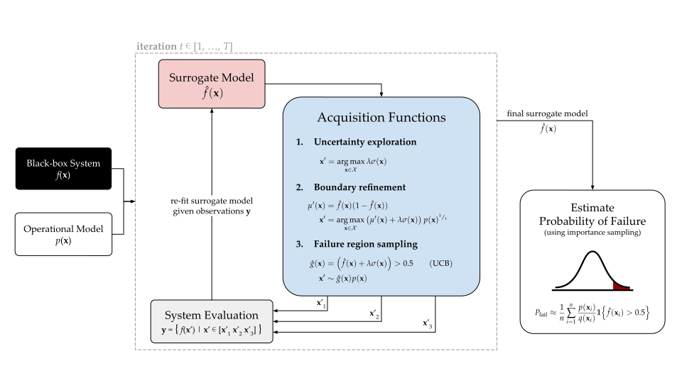

# BayesianFailureProbability.jl
Estimate the probability of failure iteratively using a Gaussian process surrogate model and importance sampling, reframing the Bayesian optimization problem as a falsification and probability estimation problem.

> _Documentation forthcoming (famous last words)._



## Installation
### Dependencies
- Install [Julia](https://julialang.org/). For example with Ubuntu:
    ```bash
    cd ~
    wget https://julialang-s3.julialang.org/bin/linux/x64/1.8/julia-1.8.3-linux-x86_64.tar.gz
    tar xvzf julia-1.8.3-linux-x86_64.tar.gz
    export PATH="${PATH}:${HOME}/julia-1.8.3/bin/"
    ```
- Install the [QtWayland](https://wiki.qt.io/QtWayland) module:
    ```
    sudo apt install qtwayland5
    ```
### Package
Start Julia from the repository root: `julia`
- Enter [Pkg.jl REPL mode](https://docs.julialang.org/en/v1/stdlib/REPL/#Pkg-mode) by typing `]`
- Create a Julia environment for this package: `activate .`
- Install dependencies `instantiate`

## Usage
A good starting point is to run the examples:
```
julia --project=. ./src/example.jl
```


Example output:
```bash
[ Info: Refinement iteration 1 (acquisition 1)
[ Info: Refinement iteration 1 (acquisition 2)
[ Info: Refinement iteration 1 (acquisition 3)
[ Info: Evaluating dummy linear system (Any[[0.0, 0.0], [4.974874371859296, 4.974874371859296], [4.773869346733668, 4.321608040201005]])...
[ Info: Refinement iteration 2 (acquisition 1)
[ Info: Refinement iteration 2 (acquisition 2)
[ Info: Refinement iteration 2 (acquisition 3)
...
```
