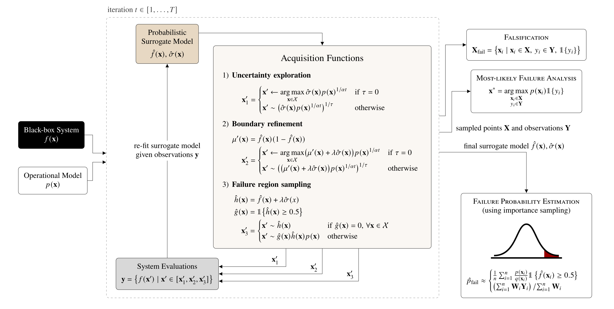

# BayesianSafetyValidation.jl
[](https://arxiv.org/abs/2305.02449)

Estimate the probability of failure iteratively using a Gaussian process surrogate model and importance sampling, reframing the Bayesian optimization problem as a falsification and probability estimation problem.

```
@article{moss2023bayesian,
    title = {{Bayesian Safety Validation for Failure Probability Estimation of Black-Box Systems}},
    author = {Robert J. Moss and Mykel J. Kochenderfer and Maxime Gariel and Arthur Dubois},
    journal = {{AIAA Journal of Aerospace Information Systems (JAIS)}},
    year = {2024},
    url = {https://doi.org/10.2514/1.I011395}
}

@inproceedings{moss2023bayesian,
    title = {{Bayesian Safety Validation for Black-Box Systems}},
    author = {Robert J. Moss and Mykel J. Kochenderfer and Maxime Gariel and Arthur Dubois},
    booktitle = {{AIAA AVIATION Forum}},
    year = {2023},
}
```

Baseline comparison on a complex failure region shape fitting the same GP using 300 selected points (from the `src/systems/dummy_shape_system.jl` example).


The algorithmic details can be seen in this diagram:



## Installation

```julia
] add https://github.com/sisl/BayesianSafetyValidation.jl
```


## Interface
Users define the following interface for their own black-box system:

```julia
"""
Abstract base type for parameters used by the system under test.
"""
abstract type SystemParameters end


"""
Interface function to reset the system under test.
"""
function reset(sparams::SystemParameters; kwargs...) end


"""
Interface function to initialize the system under test.
"""
function initialize(sparams::SystemParameters; kwargs...) end


"""
Interface function to generate input to the system based on the selected parametric sample,
e.g., take an image and return the parameters used to generate that image.
"""
generate_input(sparams::SystemParameters, sample::Vector; kwargs...)::Vector = sample # Default: pass-through


"""
Interface function to call/evaluate the system under test (SUT) given the generated input.
Returns a boolean `true` if the system failed.
"""
function evaluate(sparams::SystemParameters, inputs::Vector; kwargs...)::Vector{Bool} end
```

See interface at `src/systems/system.jl`.


## Example usage

```julia
using BayesianSafetyValidation

@with_kw mutable struct ExampleSystem <: System.SystemParameters
    x1c = 2
    x2c = 5
end

function System.evaluate(sparams::ExampleSystem, inputs::Vector; kwargs...)
    return [x[1] ≥ sparams.x1c && x[2] ≥ sparams.x2c for x in inputs]
end

system_params = ExampleSystem()
px1 = OperationalParameters("distance", [0.1, 4], TruncatedNormal(0, 1.0, 0, 4))
px2 = OperationalParameters("slope", [1, 7], Normal(3, 0.5))
model = [px1, px2]

surrogate  = bayesian_safety_validation(system_params, model; T=30)
X_failures = falsification(surrogate.x, surrogate.y)
ml_failure = most_likely_failure(surrogate.x, surrogate.y, model)
p_failure  = p_estimate(surrogate, model)
```


Four different iterations of BSV testing a runway detection algorithm in the X-Plane simulator:

