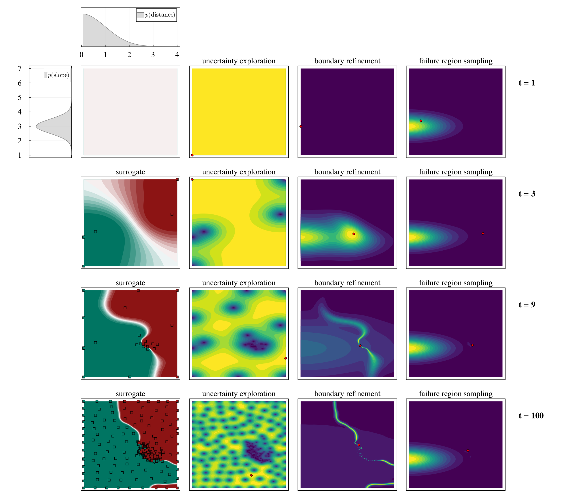

# BayesianSafetyValidation.jl
[](https://arxiv.org/abs/2305.02449)

Estimate the probability of failure iteratively using a Gaussian process surrogate model and importance sampling, reframing the Bayesian optimization problem as a falsification and probability estimation problem.

```
@inproceedings{moss2023bayesian,
    title = {{Bayesian Safety Validation for Black-Box Systems}},
    author = {Robert J. Moss and Mykel J. Kochenderfer and Maxime Gariel and Arthur Dubois},
    booktitle = {{AIAA AVIATION Forum}},
    year = {2023},
}
```


## Installation

```julia
] add https://github.com/sisl/BayesianSafetyValidation.jl
```

## Example usage

```julia
using BayesianSafetyValidation

@with_kw mutable struct ExampleSystem <: System.SystemParameters
    x1c = 2
    x2c = 5
end

System.generate_input(sparams::ExampleSystem, sample::Vector; kwargs...) = sample # pass-through
function System.reset(::ExampleSystem) end
function System.initialize(; kwargs...) end
function System.evaluate(sparams::ExampleSystem, inputs::Vector; kwargs...)
    return [x[1] ≥ sparams.x1c && x[2] ≥ sparams.x2c for x in inputs]
end

system_params = ExampleSystem()
px1 = OperationalParameters("distance", [0.1, 4], TruncatedNormal(0, 1.0, 0, 4))
px2 = OperationalParameters("slope", [1, 7], Normal(3, 0.5))
model = [px1, px2]

surrogate  = bayesian_safety_validation(system_params, model; T=30)
X_failures = falsification(surrogate.x, surrogate.y)
ml_failure = most_likely_failure(surrogate.x, surrogate.y, model)
p_failure  = p_estimate(surrogate, model)
```

## Visualizations

Below is an example from `src/systems/dummy_booth_system.jl`:


